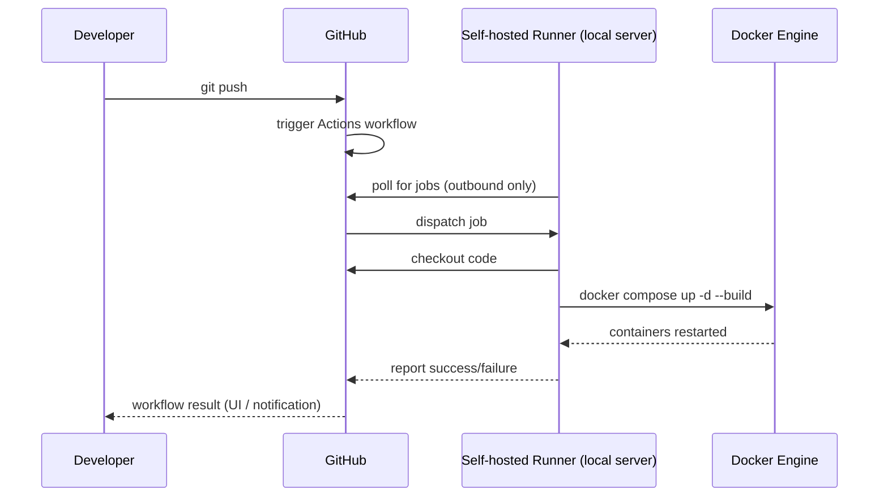
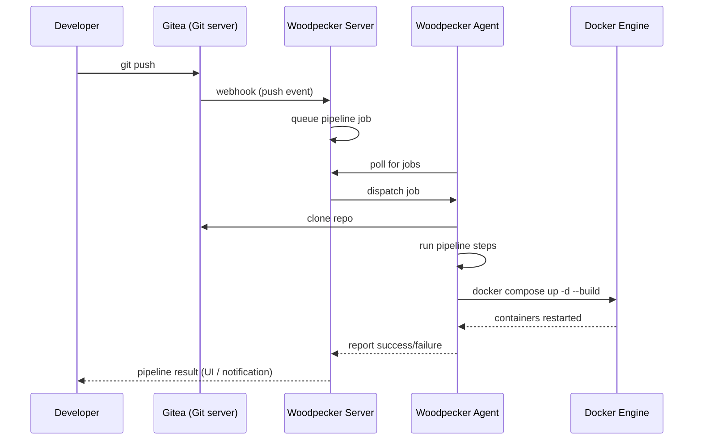

# Simple CI/CD Pipeline

## Overview

GitHub Actions is free for public repos and gives 2,000 minutes/month for private repos.

The simplest approach: **on push to `main`, SSH into your server and redeploy.**

```
git push → GitHub Actions → SSH into server → git pull + docker compose up
```

No container registry needed. The server clones/pulls the repo directly and rebuilds locally.

---

## Setup

### 1. Generate a deploy SSH key

```bash
ssh-keygen -t ed25519 -C "github-deploy" -f ~/.ssh/github_deploy -N ""
```

Add the **public key** to your server's `~/.ssh/authorized_keys`.

### 2. Add GitHub Actions secrets

Repo → Settings → Secrets → Actions:

| Secret | Value |
|--------|-------|
| `DEPLOY_HOST` | your server IP/hostname |
| `DEPLOY_USER` | your SSH username |
| `DEPLOY_KEY` | content of `~/.ssh/github_deploy` (private key) |
| `DEPLOY_PATH` | path on server, e.g. `/srv/kanban` |

### 3. Create `.github/workflows/deploy.yml`

```yaml
name: Deploy

on:
  push:
    branches: [main]

jobs:
  deploy:
    runs-on: ubuntu-latest
    steps:
      - name: Deploy via SSH
        uses: appleboy/ssh-action@v1
        with:
          host: ${{ secrets.DEPLOY_HOST }}
          username: ${{ secrets.DEPLOY_USER }}
          key: ${{ secrets.DEPLOY_KEY }}
          script: |
            cd ${{ secrets.DEPLOY_PATH }}
            git pull origin main
            docker compose up -d --build
```

### 4. Clone the repo on your server (first time only)

```bash
git clone https://github.com/youruser/yourrepo.git /srv/kanban
cd /srv/kanban
cp .env.example .env  # edit with your passwords
docker compose up -d --build
```

---

## Optional additions

### Run tests before deploy

Add a test job that `deploy` depends on:

```yaml
jobs:
  test:
    runs-on: ubuntu-latest
    steps:
      - uses: actions/checkout@v4
      - uses: actions/setup-node@v4
        with: { node-version: 20 }
      - run: cd app && npm ci && npm test

  deploy:
    needs: test
    runs-on: ubuntu-latest
    steps:
      - name: Deploy via SSH
        uses: appleboy/ssh-action@v1
        with:
          host: ${{ secrets.DEPLOY_HOST }}
          username: ${{ secrets.DEPLOY_USER }}
          key: ${{ secrets.DEPLOY_KEY }}
          script: |
            cd ${{ secrets.DEPLOY_PATH }}
            git pull origin main
            docker compose up -d --build
```

### Deploy only on tagged releases

```yaml
on:
  push:
    tags: ['v*']
```

### Notifications on failure

Add a step with `if: failure()` to send Slack/email alerts.

---

## Options for servers without inbound internet access

If the server is inside a local network and cannot receive inbound connections from GitHub, two approaches work.

### Which to choose

| | Option A (GitHub + self-hosted runner) | Option B (Gitea + Woodpecker) |
|---|---|---|
| Setup effort | Low | Medium |
| Depends on GitHub | Yes | No |
| Works offline | No (needs GitHub access) | Yes |
| Familiarity | Same GitHub Actions syntax | New pipeline format |

**If the server has internet access (just no inbound):** Option A is the path of least resistance.

**If fully air-gapped or you want independence from GitHub:** Option B with Gitea + Woodpecker.

---

## Option A: GitHub + self-hosted runner

A small agent installed on the local server **polls GitHub outbound** — no inbound connection needed. The repo stays on GitHub.

### Flow



### Setup

1. Repo → Settings → Actions → Runners → "New self-hosted runner"
2. Run the registration script GitHub provides on your server
3. Change `runs-on` in your workflow:

```yaml
jobs:
  deploy:
    runs-on: self-hosted
    steps:
      - uses: actions/checkout@v4
      - run: docker compose up -d --build
```

No SSH required — the runner is already on the server and checks out code directly.

---

## Option B: Fully self-hosted with Gitea + Woodpecker CI

Both services run on your local server. No dependency on GitHub.

- **Gitea** — self-hosted Git with a GitHub-like UI
- **Woodpecker CI** — lightweight CI that connects to Gitea via local webhooks

### Flow



All traffic is internal — the only outbound call is `git push` from your machine to Gitea, which is also on the local network.

### docker-compose.yml additions

```yaml
services:
  gitea:
    image: gitea/gitea:latest
    ports: ["3001:3000"]
    volumes: ["gitea-data:/data"]

  woodpecker-server:
    image: woodpeckerci/woodpecker-server:latest
    ports: ["8000:8000"]
    environment:
      - WOODPECKER_GITEA=true
      - WOODPECKER_GITEA_URL=http://gitea:3000
      - WOODPECKER_GITEA_CLIENT=<oauth-client-id>
      - WOODPECKER_GITEA_SECRET=<oauth-secret>
      - WOODPECKER_AGENT_SECRET=a-random-secret

  woodpecker-agent:
    image: woodpeckerci/woodpecker-agent:latest
    volumes: ["/var/run/docker.sock:/var/run/docker.sock"]
    environment:
      - WOODPECKER_SERVER=woodpecker-server:9000
      - WOODPECKER_AGENT_SECRET=a-random-secret
```

### Pipeline file (`.woodpecker.yml` in repo root)

```yaml
steps:
  - name: deploy
    image: docker
    volumes: ["/var/run/docker.sock:/var/run/docker.sock"]
    commands:
      - docker compose up -d --build
```

---

## Alternatives (no self-hosted server)

| Option | Cost | Notes |
|--------|------|-------|
| **Fly.io** | Free tier | Dockerfile support, `flyctl deploy` in Actions |
| **Railway** | Free tier | Auto-deploys from GitHub, no workflow needed |
| **Render** | Free tier | Connects to repo, auto-deploys |

Note: free tier servers on these platforms sleep after inactivity.
